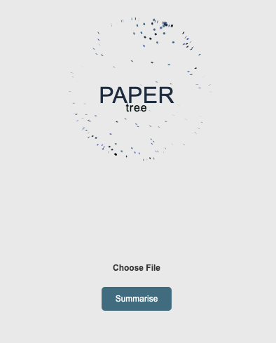

# Paper Tree 
Website
[Paper Tree](https://papertree.azurewebsites.net/)

#### Video Demo:  <https://youtu.be/c5f8OD5a_L4>

<p align="center">
  
</p>

## Description:

A science paper summariser along with a virtualised author of the papers, utilising the power of OpenAI's GPT-3. Currently all science papers are searched through the Arxiv database through the use of their API. This project aims to shorten the time for researchers to understand the core concepts of a science paper, allowing a larger scope on their studies. This would be ideal if you wish to 'test the waters' of a science paper with a 1 minute read before investing 15-20 minutes of your time on the full paper. Additionally the chatbot allows users to discuss with the 'authors' of the paper, and can engage in conversations with creative insight.

***
  
### Search 
Results are capped at 5 for this demostration. Below is the interface users will navigate to after searching.

<p align="center">
  
</p>

### !Loading!
NOTE! Due to the high traffic with OpenAI's services, load times will be quite long. Unfortunatly we expect wait times to range between 30-90secs...
<p align="center">
  
</p>

### Completed Summary
<p align="center">
  
</p>


### Chat Example Use
Science Paper = Evolution of Massive Black Holes
https://arxiv.org/pdf/0709.1722v2.pdf

<div align="center">
  
  
</div>


#### HUMAN: 
How can we expand on these findings?
#### AI: 
Further research can expand on these findings by exploring the influence of black hole mergers on the occupancy of galaxy centers, as well as the dependence of the alignment timescale in a Shakura & Sunyaev disc on viscosity, black hole mass, Eddington ratio, and accreted mass. It would also be beneficial to investigate further examples of black holes that demonstrate a morphology-related bimodality of spin distribution.

***

## The Modules
This web-app is a consolidation of 3 main modules.
Arxiv Search API --> Text Rank Extraction (NLTK) --> OpenAI API

### Arxiv Search API - search.py

This is where the Arxiv API calls are made. Initially I have it all organised in a way in which the API call is broken into modulised sections within the arxivSearch() function so I can revisit with adjustments if need be. Like extending the search range from 5 to 10 later on.
The API returns an XML which I then extract through the function responseXML(). This function searches through the XML looking for the 'abstract', 'authors', and the 'URL' which will lead to the PDF hosted in the arxiv database. All this is then sent to /search displaying the top 5 results of the API call. From there the user can get a glimspe of the papers, deciding which one to summarise.

### Text Rank Extraction (NLTK) - helpers.py

This module focuses on breaking down the entire Science Paper into a list of key sentences through machine learning algorithms (Sumy Python Library).
Using JS, Flask will recieve the URL the user requested to summarise. The URL is sent through to helpers.py where I host the PDF extraction and sumy functions. With the PYPDF2 library I simply concatenate all worded content into a singular string by iterating through the pages of the PDF document. Note I additionally had to convert the URL request from raw bytes into a format for PYPDF2 to read upon. 
Following the documentation for the SUMY library, set the hard sentence limit of 15. From my tests it seems TextRank was the most suitable for science paper summaries and so I used that to be the main driver for this module. I note that the 15 sentences limit may skip over vital points presented in papers (especially the longer ones), however the objective was to assemble context for GPT-3 to work with and so I had to make such a hard design/enginering choice due to GPT-3's current limitations.

### OpenAI API Call - gpt3.py

From the TextRank algorithm, the list of sentences are then sent into OpenAI GPT-3's da-vinci-003 model for summarisation. The logic for this module is to have GPT-3 glue together the sentences and write a summarisation based off the key points gathered from TextRank.
Within workers.py -> essayAI(), you will see that I have the configuration and prompt design laid out in a clear manner to enable editing and experimentation. The temperature was set to 50% (0.5) which I felt was a good balance between creativity in the writing and the assurance of logic from the TextRank extractions. You can see the command to the AI written and the {sentences} it based it's writings off. Within the chatAI() is the core of the chatbot. So far it works in a simple manner by retrieving the user chat input, and the summarised paper, organised in a well designed OPENAI text prompt.

## Additional Use Cases
[Paper Tree Upload](https://papertree.azurewebsites.net/upload) <br>
If you wish to test your own paper or have a paper not found within the ARXIV database, you can upload a PDF to the above link. Note this link is inaccesible from the main site as it is a feature for a select few like yourself!

<p align="center">
  
</p>

## Command Line usage
You can download the repo, and utilise main.py within the commandline. 
First make sure you are in the directory.

Ensure that you create a new python venv. I personally suggest using Conda env, but python native venv works just fine.
```python copy
python3 -m venv env
```
```
source env/bin/activate
```

Install the requirements via requirements.txt
```python copy
pip install -r requirements.txt
```

Install punkt from NLTK (A requirement with the Natural Language ToolKit)
```
python -c 'import nltk; nltk. download("punkt")'
```
From now you can use it by providing the file path with -f. You can use the testpaper.pdf I have provided within the repo. Example below.
```
python main.py -f testpaper.pdf
```


## Future Implementations/Features

None, this was a school project and I have moved on to making better code!
